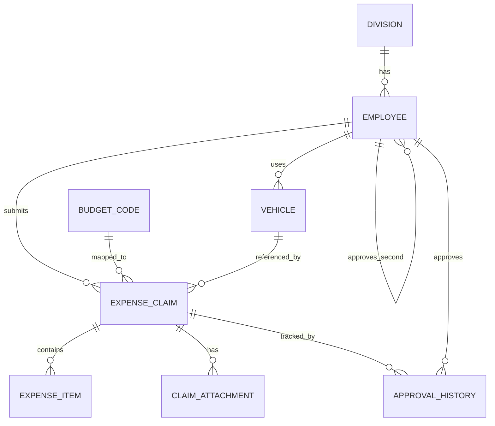

# Database Schema - TravelLedger

## 1) Division
Menyimpan master divisi / department.

| Field | Type | Keterangan |
|---|---|---|
| id | BigAutoField | PK |
| name | CharField(150) | Nama divisi |
| created_at | DateTimeField | Timestamp create |
| updated_at | DateTimeField | Timestamp update |

## 2) Employee
Menyimpan karyawan yang membuat claim atau menjadi approver.

| Field | Type | Keterangan |
|---|---|---|
| id | BigAutoField | PK |
| employee_code | CharField(30), unique | ID karyawan |
| name | CharField(150) | Nama karyawan |
| division_id | FK -> Division | Divisi |
| job_title | CharField(150) | Jabatan |
| email | EmailField | Email |
| bank_account_number | CharField(50) | No rekening |
| bank_name | CharField(150) | Nama bank |
| approver_first_id | FK -> Employee | Approval layer 1 |
| approver_second_id | FK -> Employee | Approval layer 2 |
| created_at | DateTimeField | Timestamp create |
| updated_at | DateTimeField | Timestamp update |

## 3) BudgetCode
Master budget code untuk kebutuhan posting biaya.

| Field | Type | Keterangan |
|---|---|---|
| id | BigAutoField | PK |
| code | CharField(50), unique | Kode budget |
| description | CharField(255) | Deskripsi |
| is_active | BooleanField | Status aktif |
| created_at | DateTimeField | Timestamp create |
| updated_at | DateTimeField | Timestamp update |

## 4) Vehicle
Master kendaraan yang bisa dipakai employee untuk perjalanan.

| Field | Type | Keterangan |
|---|---|---|
| id | BigAutoField | PK |
| employee_id | FK -> Employee | Pemilik/pengguna |
| brand | CharField(100) | Merek kendaraan |
| model | CharField(100) | Model kendaraan |
| registration_number | CharField(40) | Nomor polisi |
| created_at | DateTimeField | Timestamp create |
| updated_at | DateTimeField | Timestamp update |

## 5) ExpenseClaim
Header transaksi claim.

| Field | Type | Keterangan |
|---|---|---|
| id | BigAutoField | PK |
| document_id | CharField(30), unique | Nomor dokumen claim |
| employee_id | FK -> Employee | Pengaju claim |
| submission_date | DateField | Tanggal submit |
| currency | CharField(10) | Mata uang |
| vehicle_id | FK -> Vehicle | Kendaraan |
| budget_code_id | FK -> BudgetCode | Budget code |
| advance_received | DecimalField(14,2) | Uang muka yang sudah diterima |
| notes | TextField | Catatan pengajuan |
| status | CharField(20) | draft/pending/approved/rejected/paid |
| created_at | DateTimeField | Timestamp create |
| updated_at | DateTimeField | Timestamp update |

### Derived values
- `gross_total` = sum dari semua `ExpenseItem.line_total`
- `net_reimbursement` = `gross_total - advance_received`

## 6) ExpenseItem
Detail per tanggal/perjalanan.

| Field | Type | Keterangan |
|---|---|---|
| id | BigAutoField | PK |
| claim_id | FK -> ExpenseClaim | Header claim |
| date | DateField | Tanggal expense |
| odometer_start | PositiveIntegerField | KM awal |
| odometer_end | PositiveIntegerField | KM akhir |
| purpose | CharField(255) | Tujuan / keperluan |
| transport_cost | DecimalField(14,2) | Biaya transport |
| parking_cost | DecimalField(14,2) | Biaya parkir |
| toll_cost | DecimalField(14,2) | Biaya tol |
| fuel_misc_cost | DecimalField(14,2) | BBM / misc |
| receipt | ImageField | Bukti per line item |
| created_at | DateTimeField | Timestamp create |
| updated_at | DateTimeField | Timestamp update |

### Derived value
- `line_total` = transport + parking + toll + fuel_misc

## 7) ClaimAttachment
Lampiran receipt terpisah dari detail item.

| Field | Type | Keterangan |
|---|---|---|
| id | BigAutoField | PK |
| claim_id | FK -> ExpenseClaim | Header claim |
| title | CharField(100) | Judul lampiran |
| attachment | ImageField | File lampiran |
| attachment_date | DateField | Tanggal receipt |
| created_at | DateTimeField | Timestamp create |
| updated_at | DateTimeField | Timestamp update |

## 8) ApprovalHistory
Riwayat approval agar audit trail tidak hilang.

| Field | Type | Keterangan |
|---|---|---|
| id | BigAutoField | PK |
| claim_id | FK -> ExpenseClaim | Claim yang diproses |
| approver_id | FK -> Employee | User approver |
| level | PositiveSmallIntegerField | Level approval |
| action | CharField(20) | submitted/approved/rejected/returned |
| comment | TextField | Catatan approver |
| acted_at | DateTimeField | Waktu aksi |
| created_at | DateTimeField | Timestamp create |
| updated_at | DateTimeField | Timestamp update |

## Relationship Summary
- 1 Division -> banyak Employee
- 1 Employee -> banyak Vehicle
- 1 Employee -> banyak ExpenseClaim
- 1 BudgetCode -> banyak ExpenseClaim
- 1 ExpenseClaim -> banyak ExpenseItem
- 1 ExpenseClaim -> banyak ClaimAttachment
- 1 ExpenseClaim -> banyak ApprovalHistory
- Employee self-reference -> approver layer 1 dan 2

## ERD (Mermaid)

